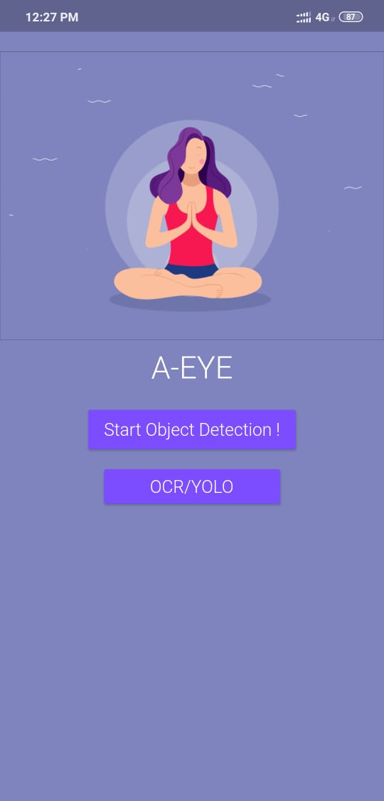
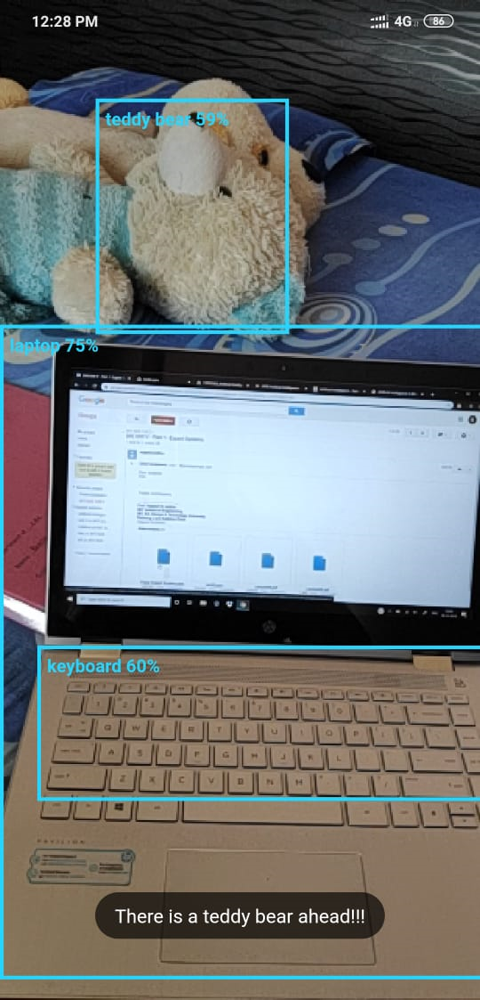
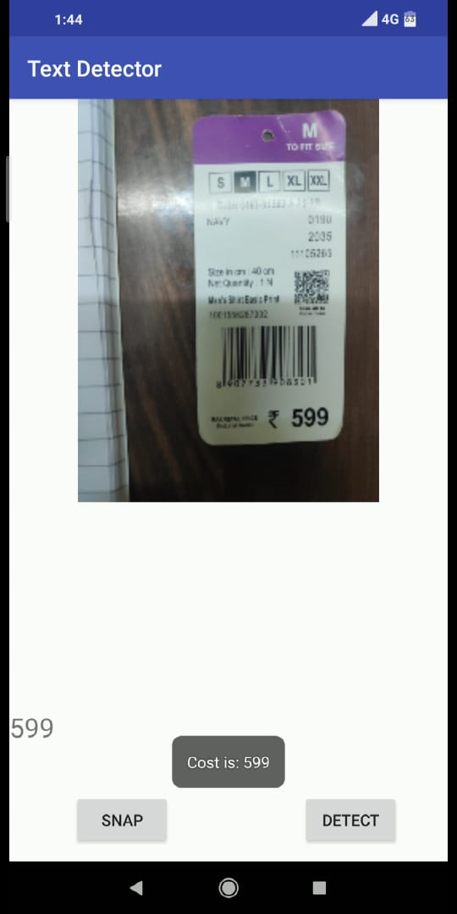

# :eye_speech_bubble: A-EYE-Mobile-Application-for-Visually-Impaired-People.

Flutter based mobile application which uses machine learning for object detection provides the name of the object and its position(either left or right side) as an audio output. It also uses optical character recognition to scan text and provides price and expiry date of the product.    

- Flutter framework was used to develop this application, thus, this app will run on Android as well as on iOS platform.  
- TensorFlow Lite and MobileNet provide the necessary dependencies and will do the required object detection.    

#### SYSTEM BLOCK DIAGRAM:  

### Modules:  
##### :point_right: Module 1:  User Interface  
Android/iOS application is built using Flutter Framework and Google TalkBack utilization. Flutter supports Dart Language.Hence User Interface is created in Dart Language.UI consist of Home Page which cordially invited blind users to start the app. There are two options provided for users:    
1)Start Object Detection !  
2)OCR  
  
##### :point_right: Module 2:  Object Detection  
Given an image or a video stream, an object detection model can identify which of a known set of objects might be present and provide information about their positions within the image.An object detection model is trained to detect the presence and location of multiple classes of objects.When we subsequently provide an image to the model, it will output a list of the objects it detects, the location of a bounding box that contains each object, and a score that indicates the confidence that detection was correct.
For each detected object, the model will return an array of four numbers representing a bounding rectangle that surrounds its position. For the starter model we provide, the numbers are ordered as follows:[top,left,right,bottom]
Object with maximum accuracy is labelled and its speech output is given.
Pretrained model : MobileNet  
  
##### :point_right: Module 3:  OCR  
OCR module is used to convert the text inside the image into an actual text. Our app needs this to recognise the content on the price tags, etc and to extract important information like the product name, contents and price tags. 
To do this we have divided the photo into two halves. The lower half is generally where the price is. This saves extra computations. Further in the lower half, we then focus on the text which is bold or which has a bigger text size than the rest of the text inside the image.  
  
##### :camera: Some sample images of the applications :      
              

## :man_student:  Author
 

